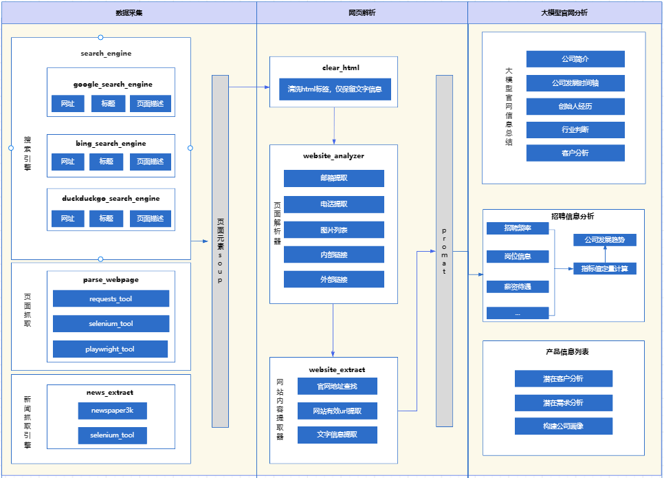

# Website Content Extraction and Analysis Tool

This tool is an efficient platform for website content extraction and analysis. Users can automatically obtain information from corporate websites, improving information collection efficiency. It is an ideal choice for corporate research, competitive analysis, and market research.

## 🖼️ System Architecture



*Figure 1: LLM Search Tool System Architecture*

## 🎯 Demo


*Figure 2: System Demo*

## Project Origin
The initial purpose of this project was to develop an automated tool for collecting company website navigation. It can obtain company websites through search engines, extract and analyze content, and finally generate company website navigation. Currently, the entire automated collection and website information extraction function has been open-sourced, and the company website navigation information generation function is under development. The code for the large model capabilities will also be open-sourced after sorting.
The current demo project address: http://yxxt.haomiaodata.com/Marketing/company, the content is the company information collected and extracted based on the model. It is still a demo version, and the new version of the company website navigation is still under development.

TODO:
Introduce large model capabilities to analyze websites and extract valuable information. Currently, only the extraction of raw text content from company websites is supported.

## 🚀 Main Features and API Endpoints
The API endpoints of this project are built based on the FastAPI framework, providing efficient and flexible interface services.

### 🔍 Intelligent Search Engine Integration `/search`
- Supports mainstream search engines such as Google, Bing, DuckDuckGo
- Configurable search engine type (`engine_name`) and filter text length (`filter_text_len`)
- Returns structured search results, including URL, title, and description
- Automatically filters irrelevant content and accurately locates target information
- Supports keyword search and advanced search syntax

### 📄 Intelligent Webpage Content Extraction `/webpage_info`
- Supports multiple parsing tools (`requests`/`selenium`/`playwright`)
- Automatically extracts webpage titles and main content
- Optionally returns the complete HTML structure
- Intelligently handles dynamically rendered pages
- Built-in error handling and retry mechanism
- Supports custom parsing rules and content filtering

### 🔎 In-depth Website Analysis `/analyze`
- Comprehensive analysis of website structure and resource distribution
- Automatically collects and categorizes internal/external links
- Intelligently extracts company information (social media, email, phone, address)
- Statistics of JS, CSS, images, and other resources
- Generates detailed JSON format analysis reports
- Supports sitemap generation and directory structure analysis
- Provides SEO-related data analysis

### 🚄 Batch Content Extraction `/extract`
- Supports parallel processing of multiple pages
- Configurable maximum number of pages to crawl (`max_page`)
- Optionally returns HTML structure (`need_soup`)
- Automatically recursively crawls related pages
- Built-in rate limiting and load balancing
- Supports custom crawling rules and filtering conditions
- Provides breakpoint resume functionality

## ⚡ Quick Start

### System Requirements

- Python 3.9 or higher
- Chrome browser (for Selenium and Playwright rendering)
- At least 2GB of available memory
- Stable network connection

### 🔧 Installation Steps

1. Clone the repository:
   ```bash
   git clone git@github.com:BetaStreetOmnis/WebAIExtracto.git
   ```

2. Install dependencies:
   ```bash
   pip install -r requirements.txt
   ```

3. Start the API service:
   ```bash
   python api_server.py
   ```
   The service will start at [http://localhost:8093](http://localhost:8093), and the complete API documentation can be viewed through Swagger UI.
